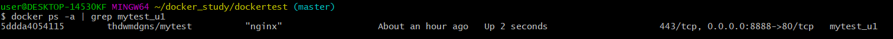
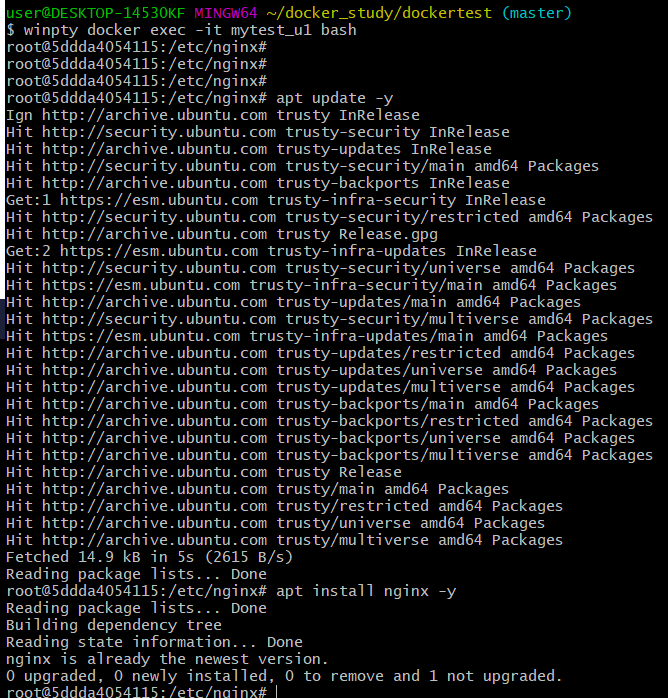

# dockertest
Git Clone 
-  git clone https://github.com/jhsong2580/dockertest.git

Git Add 
- git add * 

Git Commit 
- git commit 

Git push 
- git push 

BUILD IMAGE
- docker build -t thdwmdgns/mytest .

RUN IMAGE & Port Forwarding
- winpty docker run -it --name mytest_u1 -p 8888:80 thdwmdgns/mytest

ATTACH IMAGE
- winpty docker exec -it mytest_u1 bash

INSTALL nginx in ubuntu(already installed by Dockerfile) 
1. apt update -y 
2. apt install nginx -y

localhost:8888 

