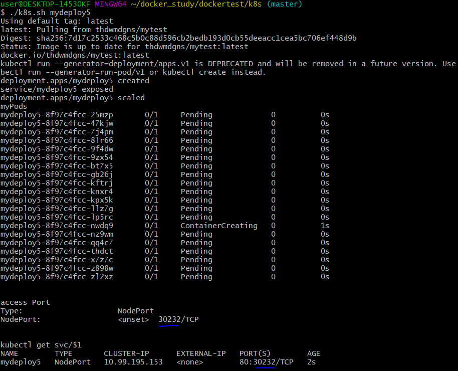

# dockertest/k8s

Get image by Docker HUB 
- docker pull thdwmdgns/mytest

make Container & map service port 80 
- winpty kubectl.exe run mytest1 --image=thdwmdgns/mytest --port=80

Expose 
- kubectl.exe expose deploy $1 --type="NodePort" --port 80

scale with 20 pods 
- kubectl.exe scale deploy mytest1 --replicas=20

confirm 
- kubectl.exe get pods | grep mytest1

confirm the port to access server
- kubectl.exe describe svc/mytest1 | grep NodePort
- kubectl.exe get svc | grep mytest1

echo ' '

